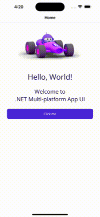

# PhotoBrowser.Maui

Full screen image viewer(.NET MAUI) that includes "pinch to zoom" and "swipe to dismiss" gestures.

[](https://www.nuget.org/packages/PhotoBrowser.Forms/)

Supports Android and iOS.
* Android library from : https://github.com/davemorrissey/subsampling-scale-image-view
* iOS library from : https://github.com/mwaterfall/MWPhotoBrowser

## Features

* Pinch to zoom.
* Swipe to dismiss.
* Custom Title.
* Custom Action Button.

## Screen-Shots

| Android sample | iOS sample |
| ------------- | ---------------
|  | 


| Table/CollectionView sample | Button tap sample 
| ------------- | ---------------
|  | 

## Setup

* Install the [nuget package](https://www.nuget.org/packages/PhotoBrowser.Maui) in portable and all platform specific projects.

### MauiProgram

In MainActivity.cs file

```cs
var builder = MauiApp.CreateBuilder();
            builder
                .UseMauiApp<App>()
                .ConfigurePhotoBrowser();
```
## Usage

```cs
    new PhotoBrowsers.PhotoBrowser
            {
                Photos = new List<Photo>
                {
                    new Photo
                    {
                        URL = "https://raw.githubusercontent.com/stfalcon-studio/FrescoImageViewer/v.0.5.0/images/posters/Vincent.jpg",
                        Title = "Vincent"
                    },
                    new Photo
                    {
                        URL = "https://raw.githubusercontent.com/stfalcon-studio/FrescoImageViewer/v.0.5.0/images/posters/Jules.jpg",
                        Title = "Jules"
                    },
                    new Photo
                    {
                        URL = "https://raw.githubusercontent.com/stfalcon-studio/FrescoImageViewer/v.0.5.0/images/posters/Korben.jpg",
                        Title = "Korben"
                    },
                    new Photo
                    {
                        URL = "https://raw.githubusercontent.com/stfalcon-studio/FrescoImageViewer/v.0.5.0/images/posters/Toretto.jpg",
                        Title = "Toretto"
                    },
                    new Photo
                    {
                        URL = "https://raw.githubusercontent.com/stfalcon-studio/FrescoImageViewer/v.0.5.0/images/posters/Marty.jpg",
                        Title = "Marty"
                    },
                    new Photo
                    {
                        URL = "https://raw.githubusercontent.com/stfalcon-studio/FrescoImageViewer/v.0.5.0/images/posters/Driver.jpg",
                        Title = "Driver"
                    },
                    new Photo
                    {
                        URL = "https://raw.githubusercontent.com/stfalcon-studio/FrescoImageViewer/v.0.5.0/images/posters/Frank.jpg",
                        Title = "Frank"
                    },
                    new Photo
                    {
                        URL = "https://raw.githubusercontent.com/stfalcon-studio/FrescoImageViewer/v.0.5.0/images/posters/Max.jpg",
                        Title = "Max"
                    },
                    new Photo
                    {
                        URL = "https://raw.githubusercontent.com/stfalcon-studio/FrescoImageViewer/v.0.5.0/images/posters/Daniel.jpg",
                        Title = "Daniel"
                    }
                },
            }.Show();
```

### More Properties
* StartIndex

## Contributions
Contributions are welcome!